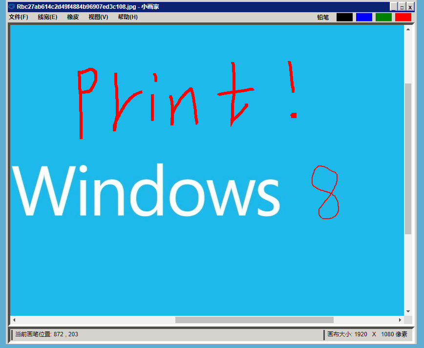

# windows-paint[网页仿 windows 画图]

### 演示地址:

### 原版 UI

### 實現效果 UI

## 使用技術: HTML5\CSS3\JS

## 第三方库: 无

## 兼容性: chrome\edge\safari\firefox

## 简介:

使用 HTML\CSS 还原 Windows 经典画图,再使用原生 js 实现功能逻辑.
可以进一步拓展成为在线图片处理程序或 webPS

## 亮点:

1. 实现纯前端的 上传处理本地图片 保存下载处理好图片到本地.
2. 使用 canvas 实现画布根据上传图片或设备大小自动使用大小
3. 实现画笔粗细、颜色修改调节,画笔坐标实时更新
4. 实现橡皮檫功能并可设置橡皮檫大小,橡皮檫使用范围控制
5. 可以按 3 种图片格式保存并重命名图片和设置图片质量【webp\png\jpeg】
6. 移动端，pc端适配同样体验

## 具体功能:

#### 文件:

1. 新建文件
2. 开启文件
3. 保存文件
4. 另存为 PNG\JPEG\WEBP
5. 结束

#### 编辑:

1. 颜色选择
2. 画笔粗细调节
3. 橡皮檫粗细调节

#### 帮助:

1. 使用说明
2. 关于画图
